# Technical Report — Exploratory Data Analysis
## AI-Powered Investment Intelligence Platform | NIFTY-50 (2000–2021)

---

## 1. Executive Summary

This report presents exploratory data analysis and quantitative findings from the NIFTY-50
historical market dataset spanning **2000-10-19** to **2021-03-26**. The platform transforms
raw OHLCV data into decision-support insights through technical feature engineering, machine
learning-based forward-return prediction, and profile-based portfolio optimization.

**Key findings:**
- **49 stocks** analyzed with **224,412** feature-engineered observations.
- Top long-term performers include **SHREECEM, BAJFINANCE, INDUSINDBK**; weakest include **IOC, ITC, ONGC**.
- Average constituent Sharpe ratio: **0.26** | Avg. volatility: **41.9%** | Avg. max drawdown: **85.6%**.
- ML model directional accuracy: **50.8%** (21-day forward return prediction).
- Conservative portfolio max drawdown (**37.1%**) is lower than Aggressive (**64.9%**).

---

## 2. Dataset Overview

| Attribute | Value |
|-----------|-------|
| Universe | NIFTY-50 constituent stocks (NSE India) |
| Period | 2000-10-19 to 2021-03-26 |
| Symbols | 49 |
| Fields | Open, High, Low, Close, Volume, Turnover |
| Metadata | Company name, Industry sector (stock_metadata.csv) |

**Figure 1** shows sector composition. Financial Services, IT, and Energy dominate the index,
providing natural diversification across economic cycles.

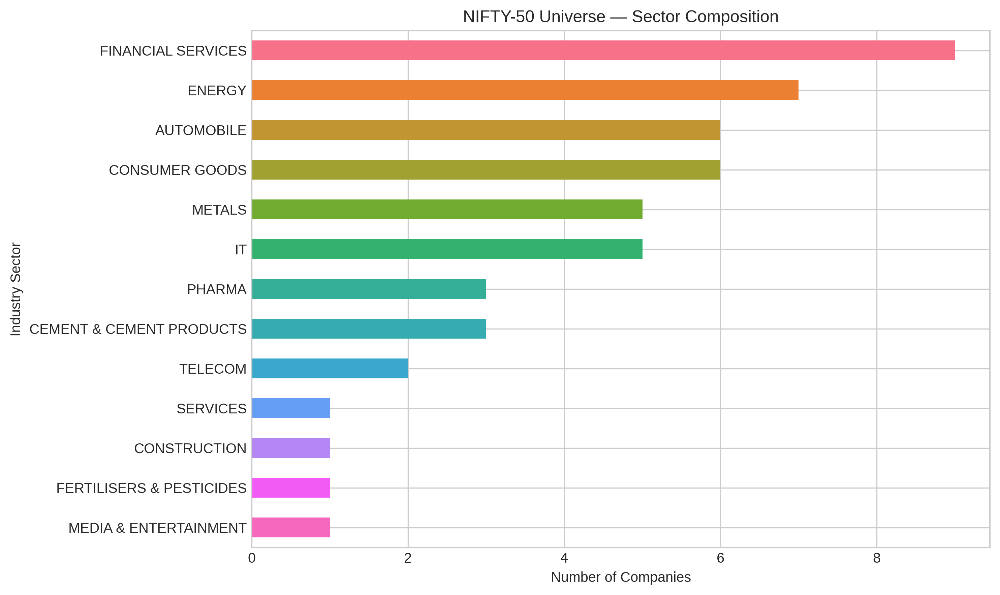

**Figure 2** confirms data coverage: most stocks have 4,000–5,300 trading days. Symbols with
shorter histories (e.g., recent index entrants) were handled via minimum-history filters in
the portfolio engine.

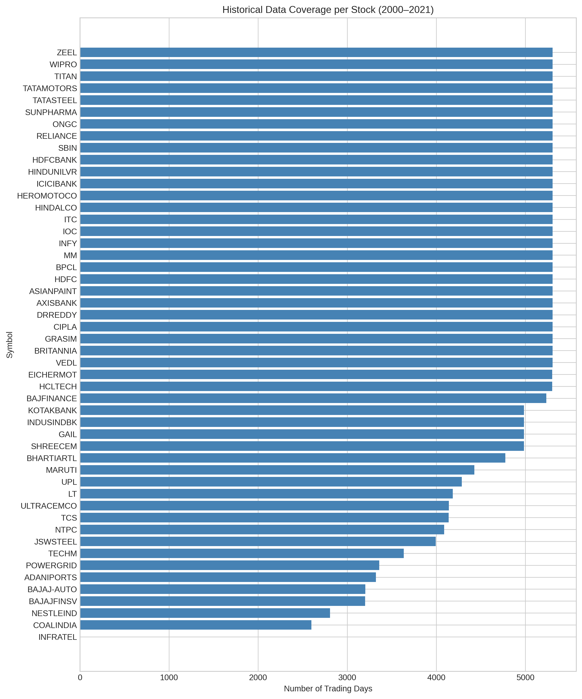

---

## 3. Price & Return Analysis

### 3.1 Long-Term Performance

Normalized price indices (base = 100) reveal significant dispersion across constituents
over two decades. IT and consumer names generally outperformed commodity-linked stocks.

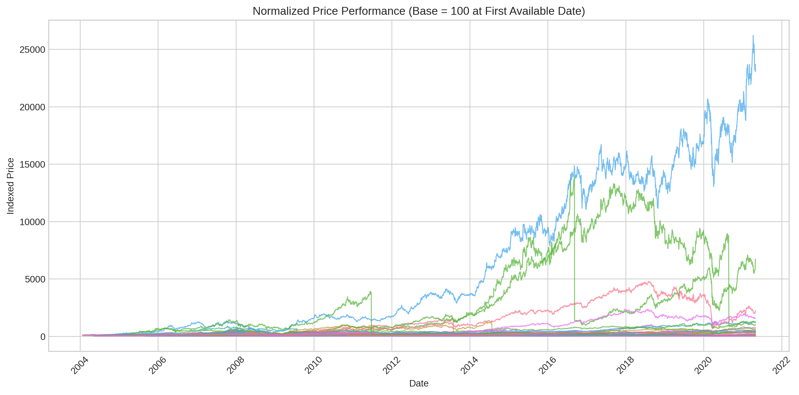

**Figure 4** ranks total returns. The best performer (**SHREECEM**, +22,947%)
and worst (**ONGC**, -86%) diverge sharply,
highlighting stock-selection risk within the index.

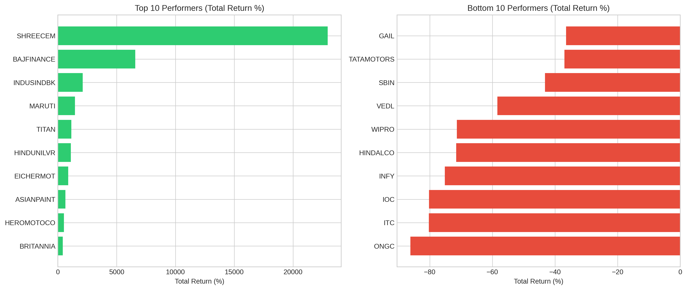

### 3.2 Return Distribution

Daily returns exhibit **fat tails** (leptokurtosis) typical of equity markets — extreme
single-day moves occur more frequently than a normal distribution predicts. This motivates
risk metrics beyond simple variance (Sortino ratio, max drawdown).

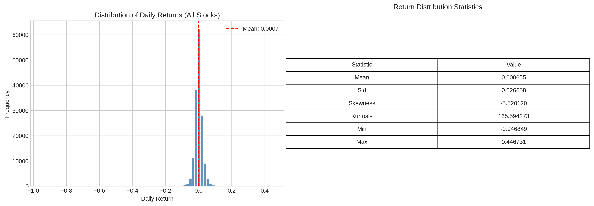

### 3.3 Correlation Structure

The correlation heatmap shows moderate-to-high positive correlations among Indian large-caps,
especially within sectors (Banking, IT). This supports covariance-aware portfolio optimization
(Modern Portfolio Theory) rather than naive equal-weighting.

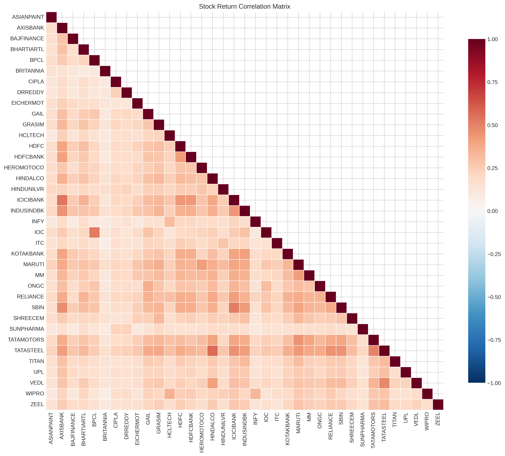

---

## 4. Volatility & Market Regimes

Rolling 20-day annualized volatility spikes coincide with known stress events:
- **2008** Global Financial Crisis
- **2016** Demonetization
- **2020** COVID-19 market crash

These regimes validate the need for profile-based allocation (Conservative vs Aggressive).

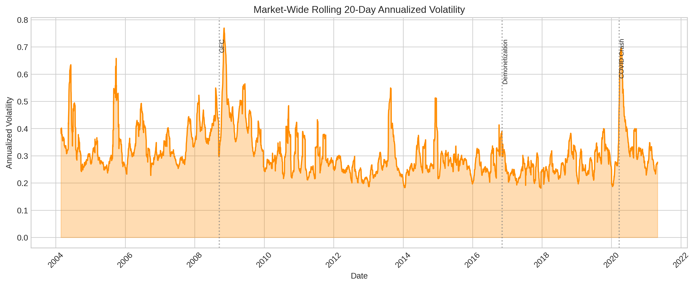

Aggregate traded volume has grown substantially over the sample, reflecting market
deepening and increased retail participation in Indian equities.

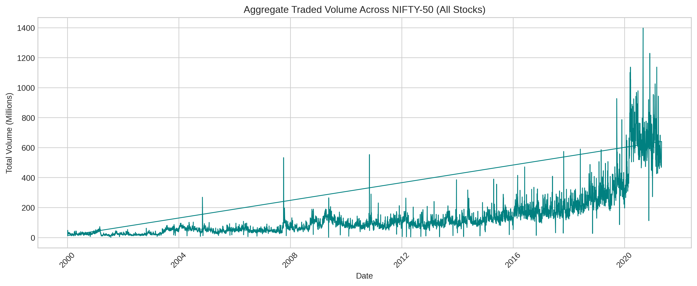

---

## 5. Risk–Return Profile of Constituents

Each stock is evaluated on annualized return, volatility, and Sharpe ratio.
The scatter plot reveals the efficient frontier opportunity set within NIFTY-50.

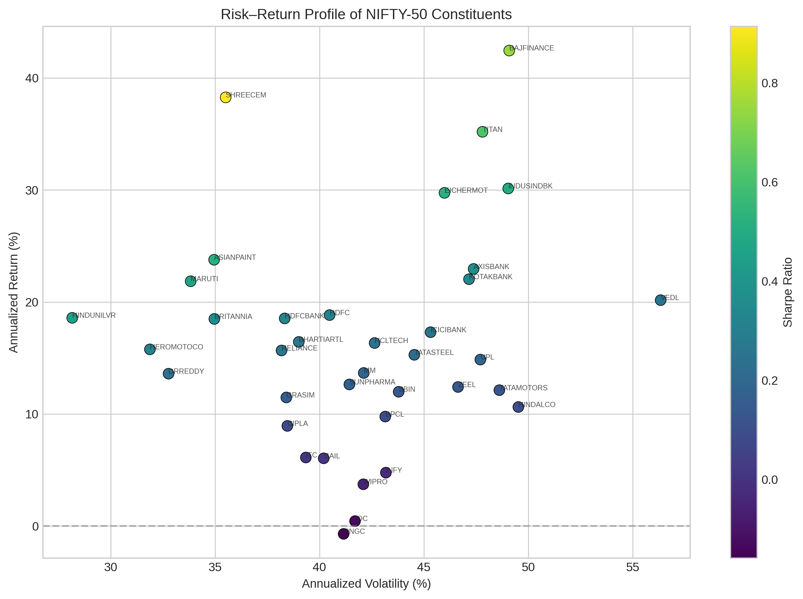

**Insight:** Stocks with high returns often carry proportionally higher volatility;
portfolio construction must explicitly trade off these dimensions by investor profile.

---

## 6. Feature Engineering

Technical indicators computed deterministically from OHLCV data:

| Feature | Description |
|---------|-------------|
| SMA_50 / SMA_200 | Trend identification (golden/death cross) |
| RSI_14 | Momentum / overbought-oversold (Wilder's smoothing) |
| MACD + Signal | Trend momentum crossover |
| Volatility_20_Ann | Rolling 20-day annualized volatility |
| Price_to_SMA50/200 | Relative price regime |
| Forward_21_Return | Target: 21-day ahead % return |

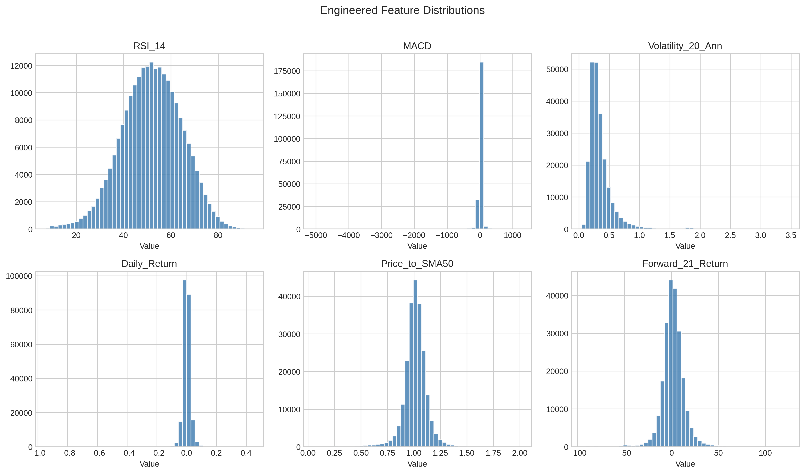

---

## 7. Predictive Model Results

**Model:** Random Forest Regressor with StandardScaler pipeline.
**Target:** Forward 21-day percentage return.
**Validation:** Chronological 80/20 hold-out + 5-fold TimeSeriesSplit CV.

| Metric | Value |
|--------|-------|
| RMSE | 14.6971 |
| MAE | 10.3872 |
| R² | -0.0805 |
| Directional Accuracy | 50.8% |

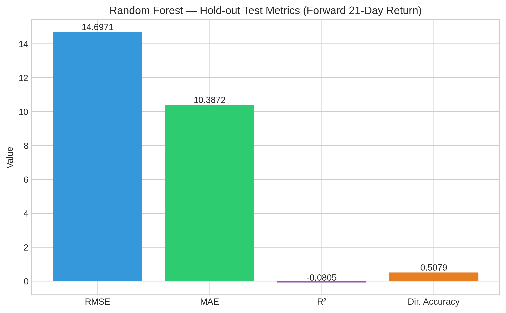

Directional accuracy above 50% indicates the model adds value for up/down classification
even when magnitude prediction is noisy (low R² is expected for equity return forecasting).

**Explainable AI:** Feature importances show which technical signals drive predictions.

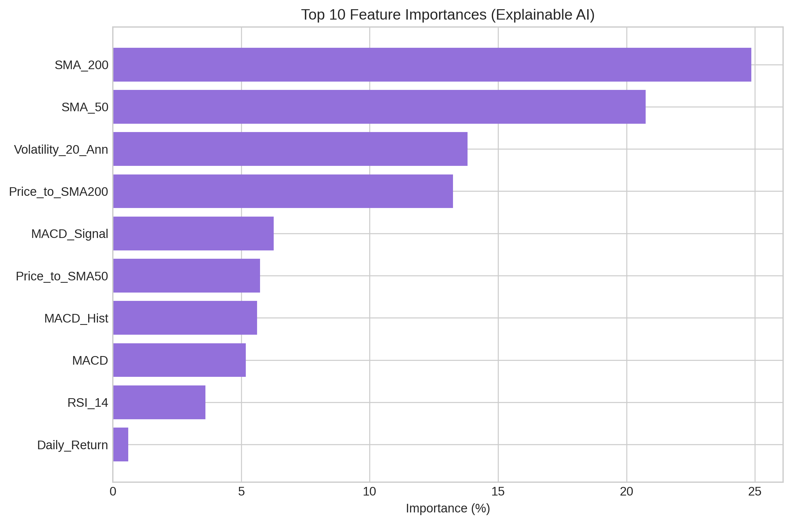

---

## 8. Portfolio Construction Results

Three investor profiles using Modern Portfolio Theory (MVO) with profile-specific overlays:

| Profile | Sharpe | Max Drawdown | Ann. Volatility | Ann. Return |
|---------|--------|--------------|-----------------|-------------|
| Conservative | 0.632 | 37.1% | 17.9% | 17.2% |
| Balanced | 0.998 | 46.4% | 18.8% | 24.6% |
| Aggressive | 0.926 | 64.9% | 23.2% | 27.3% |

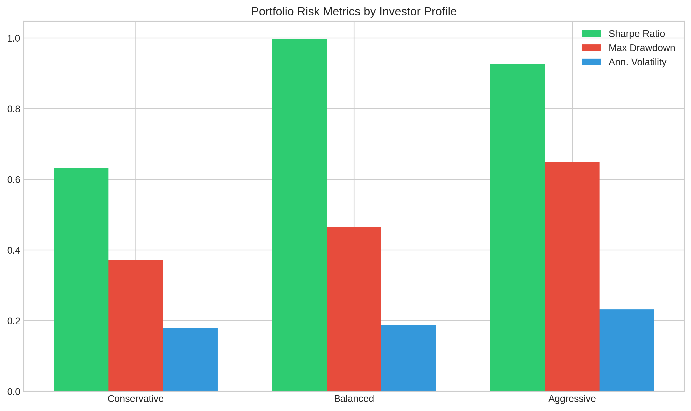
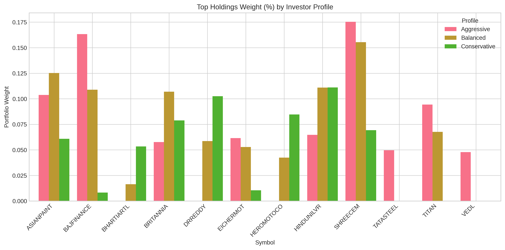
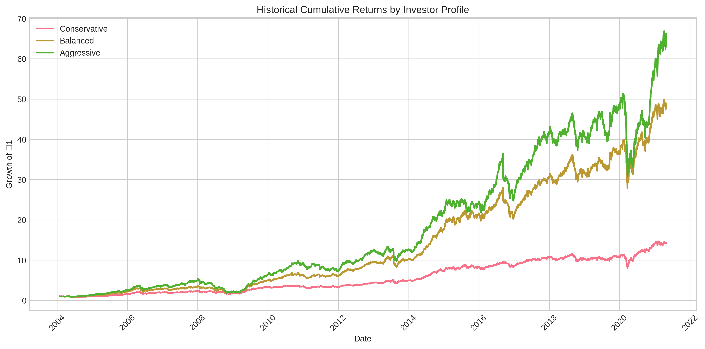

---

## 9. Assumptions & Limitations

1. **Historical simulation only** — no live data or transaction costs modeled.
2. **Risk-free rate** assumed at 6% annualized for Sharpe/Sortino calculations.
3. **Survivorship bias** — dataset reflects current/historical NIFTY-50 members.
4. **Return predictability** is limited; ML supports decision context, not certainty.
5. Past performance does not guarantee future results.

---

## 10. Conclusion

The NIFTY-50 dataset provides rich multi-decade history for building a decision-support
platform. EDA confirms fat-tailed returns, sector clustering, and regime-dependent volatility.
Combining technical feature engineering, explainable ML, and MPT-based portfolio optimization
delivers actionable intelligence tailored to Conservative, Balanced, and Aggressive investors.

---

*Generated by `eda.py` — insert figures from `output/figures/` when compiling PDF.*
